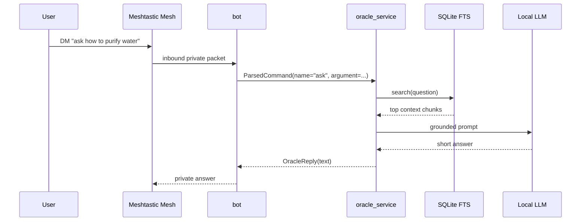
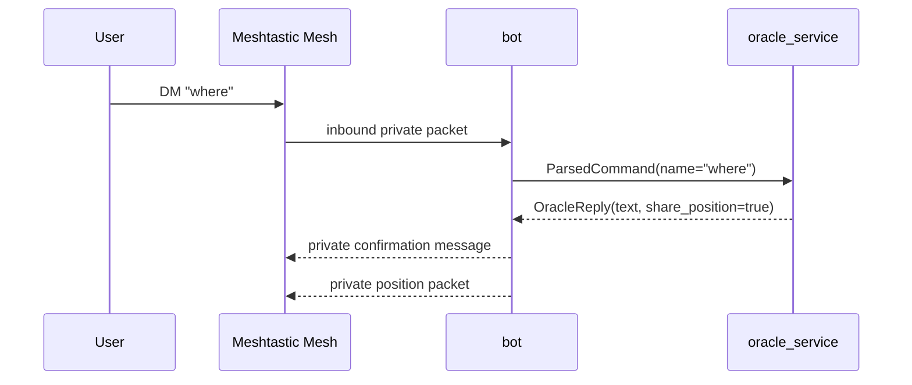
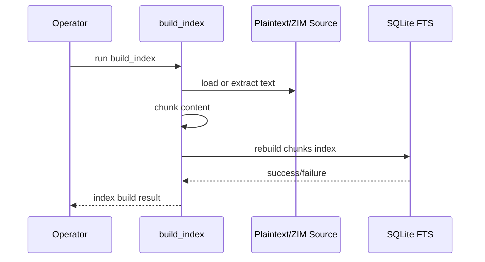

# Runtime Flows

- Purpose: Describe the main runtime sequences for answering questions, sharing position, and rebuilding the knowledge index.
- Audience: Engineering, QA, and operations.
- Owner: Software Lead
- Status: Draft v1
- Last Updated: 2026-03-11
- Dependencies: system_context.md, software_architecture.md, ../operations/service_operations.md
- Exit Criteria: Core runtime sequences are defined well enough to drive implementation, runbooks, and tests.

## Context

Runtime flows center on three repeatable behaviors: direct-message answering, private location sharing, and offline corpus ingest.

## Components

- User device
- Meshtastic radio
- `bot` service
- `core` service logic
- SQLite FTS index
- local model runtime
- operator-triggered ingest command

## Interfaces

- DM commands and private reply channel
- `python -m bot.oracle_bot`
- `python -m ingest.build_index --input-dir ... --db ...`
- `systemd` service boundaries

## Data/Control Flow

### Ask Flow

### Where Flow

### Ingest Flow

## Failure Modes

- Ask flow returns no answer because index is empty or model runtime is unavailable
- Where flow leaks publicly if routing ignores DM-only policy
- Ingest rebuild erases useful data without replacement if source directory is incomplete

## Security/Privacy Constraints

- Every flow handling user content assumes DM-only routing.
- Position sharing is a separate private packet, not embedded in public text.
- Ingest and logs must not expose sensitive local file paths more broadly than needed.
