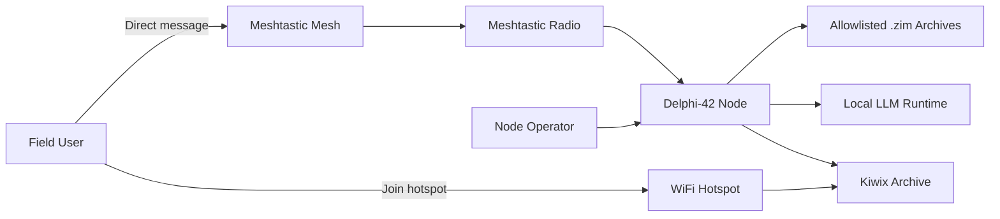

# System Context

- Purpose: Describe Delphi-42 in terms of external actors, neighboring systems, trust boundaries, and deployment context.
- Audience: Engineering, operations, and architecture reviewers.
- Owner: Systems Lead
- Status: Draft v1
- Last Updated: 2026-03-11
- Dependencies: ../overview/project_brief.md, ../hardware/node_topology.md, interfaces_and_config.md
- Exit Criteria: External actors, boundaries, and system responsibilities are explicit enough to guide implementation and operations.

## Context

Delphi-42 sits at the boundary between a low-bandwidth mesh and a physically reachable local archive. It must accept private questions over Meshtastic, respond without internet access, and reveal richer content only to users who reach the node physically.

## Components

- Field user device running Meshtastic
- Meshtastic mesh and radio hardware
- Raspberry Pi node hosting bot, retrieval, model runtime, and hotspot services
- Offline corpus and local archive server
- Operator maintenance workflows

## Interfaces

- Meshtastic DM commands: `?help`, `?where`, `?pos`, `?ask <question>`, `?chat <message>`, `?mesh`
- Private position packets returned on `where` and `pos`
- Local hotspot web access to Kiwix-served archive
- Local file-based interfaces for config, models, corpora, and indexes

## Data/Control Flow

1. User sends a DM over the mesh.
2. The node receives the packet through the radio interface.
3. The bot validates message type and parses the command.
4. The core retrieves local context and returns a short answer or private position.
5. If the user arrives physically, the hotspot grants access to the larger archive.

## Failure Modes

- Radio unavailable or serial device path incorrect
- Missing or stale text index
- Local model unavailable or too slow
- Hotspot unavailable despite core services being healthy
- Power or thermal degradation causing restarts

## Security/Privacy Constraints

- Public traffic is limited to short discovery broadcasts.
- User questions are never echoed on public channels.
- Node position is disclosed only through private response flow.
- Local logs avoid sensitive payload capture by default.
