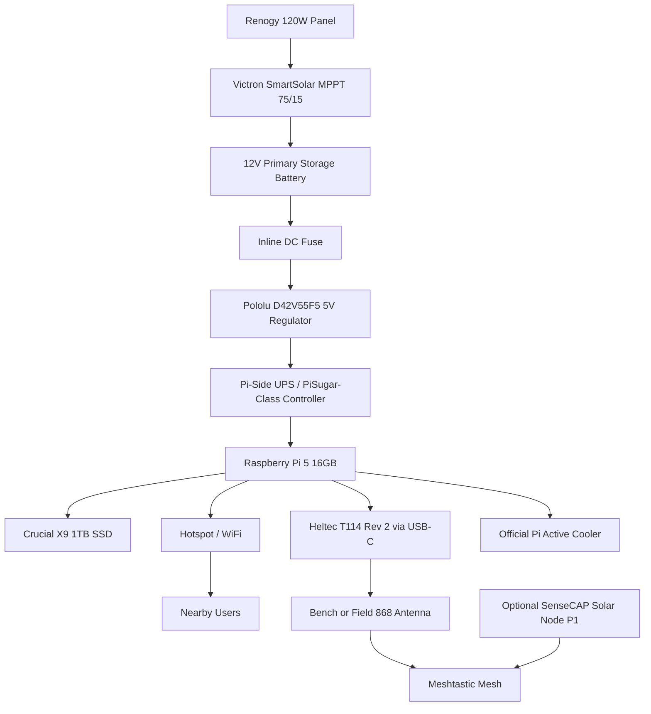

# Node Topology

- Purpose: Define the physical architecture of the Prototype v1 Delphi-42 node.
- Audience: Hardware builders, systems engineers, and operators.
- Owner: Systems Lead
- Status: Revised v1
- Last Updated: 2026-03-12
- Dependencies: bill_of_materials.md, power_thermal_and_enclosure.md, ../architecture/system_context.md
- Exit Criteria: A builder can understand the physical subsystem layout and signal/power relationships before assembly.

## Prototype V1 Topology

Prototype v1 uses a Raspberry Pi as the control and compute plane, a Heltec T114 as the Pi-attached Meshtastic interface, a USB SSD as the storage plane, and a hotspot stack for local archive access. The revised outdoor power path is a split architecture built around a 120W panel, a 12V primary storage battery, a 12V to 5V regulator, and a Pi-side UPS layer for hold-up power and graceful shutdown behavior.

## Physical Subsystems

- Compute plane: Raspberry Pi 5 16GB with official active cooling
- Radio plane: Heltec T114 Rev 2, 868 MHz, GPS variant, connected over USB-C
- Storage plane: Crucial X9 1TB external SSD
- Power plane: bench AC through the official Pi PSU, field DC through a 12V primary battery plus MPPT plus fused 5V regulator plus Pi-side UPS path
- Access plane: Pi-hosted hotspot exposing Kiwix archive
- Environmental plane: Hammond 1554X2GYCL electronics enclosure with external battery and field antenna

## Placement Guidance

- Keep the field antenna external to the enclosure and use the SECTRON R36 screw-mount assembly for the field build.
- Isolate SSD and Pi mounting so vibration does not stress cables.
- Route solar charge, battery DC, and RF paths separately to reduce accidental interference.
- Keep the primary battery external and serviceable; Prototype v1 does not bury the field battery inside the electronics enclosure.
- Preserve serviceability: operator should be able to replace storage or radio without fully disassembling the enclosure.

## Prototype Boundary

- One Pi per node
- One Pi-attached T114 per main node
- One local archive instance per node
- No redundant power or compute plane in Prototype v1
- Optional SenseCAP Solar Node P1 is treated as a remote companion or repeater, not the main oracle radio
