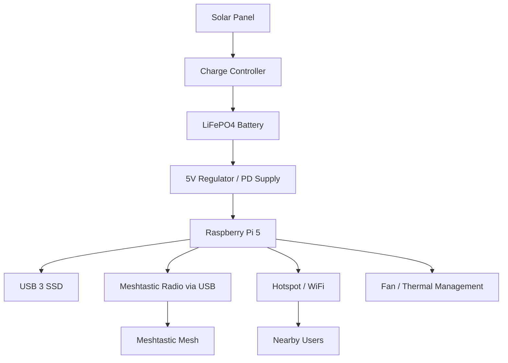

# Node Topology

- Purpose: Define the physical architecture of the Prototype v1 Delphi-42 node.
- Audience: Hardware builders, systems engineers, and operators.
- Owner: Systems Lead
- Status: Draft v1
- Last Updated: 2026-03-11
- Dependencies: bill_of_materials.md, power_thermal_and_enclosure.md, ../architecture/system_context.md
- Exit Criteria: A builder can understand the physical subsystem layout and signal/power relationships before assembly.

## Prototype V1 Topology

Prototype v1 uses a Raspberry Pi as the control and compute plane, a Meshtastic radio as the LoRa interface, an SSD as the storage plane, and a hotspot stack for local archive access.

## Physical Subsystems

- Compute plane: Raspberry Pi 5 with sufficient RAM for small local model inference and index management
- Radio plane: Meshtastic-capable device connected over USB serial
- Storage plane: external SSD for corpora, model, and index
- Power plane: battery-backed system with optional solar charging
- Access plane: Pi-hosted hotspot exposing Kiwix archive
- Environmental plane: weather-resistant enclosure with thermal management

## Placement Guidance

- Keep the radio antenna external to the enclosure when possible.
- Isolate SSD and Pi mounting so vibration does not stress cables.
- Route power and RF cleanly to reduce accidental interference.
- Preserve serviceability: operator should be able to replace storage or radio without fully disassembling the enclosure.

## Prototype Boundary

- One Pi per node
- One radio per node
- One local archive instance per node
- No redundant power or compute plane in Prototype v1
